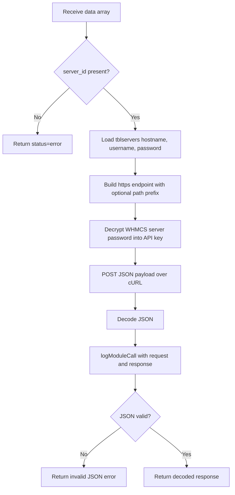

`ProductsReseller_Main` in `modules/servers/products_reseller_server/pr_server_classes.php` is the transport abstraction for the whole module. Every provisioning callback and every admin import action eventually reaches `send_request_to_api($data)`.

## What It Is

This class is the provider adapter. It exists so the rest of the code can think in terms of actions like `CreateAccount`, `Get_Products`, or `Save_Product_Mapping` instead of reimplementing cURL, endpoint construction, and response parsing in multiple files.

## Why It Exists

The module has several independent call sites:

- provisioning callbacks in `products_reseller_server.php`
- capability checks and cPanel SSO
- usage lookups for `cpanel.tpl`
- admin-side import requests from `ajax_functions.php`
- mapping cleanup from the `ProductDelete` hook in `prs_hooks.php`

Without one transport class, each of those paths would need to repeat the same sequence: find the WHMCS server row, decrypt the stored password, build the endpoint, JSON-encode the request, parse JSON, and log the result.

## How It Relates To Other Concepts

- [Module Lifecycle](/docs/module-lifecycle) depends on the wrapper methods that convert raw provider responses into WHMCS callback return values.
- [Product Import and Sync](/docs/product-import-sync) uses the raw transport method more directly because it needs provider payloads like pricing arrays and mapping responses.
- [Client Area and SSO](/docs/client-area-and-sso) uses `get_server_name()`, `get_cpanel_sso()`, and `get_usage_deatils()` to expose provider capabilities into the UI.

## How It Works Internally

The internal logic of `send_request_to_api($data)` is compact but important:



### Endpoint construction

The module intentionally splits the upstream address across two WHMCS fields:

- `tblservers.hostname` becomes the base host.
- `tblservers.username` becomes an optional path prefix.

If a path prefix exists, the final endpoint is:

```text
https://{hostname}/{username}/modules/addons/products_reseller/api.php
```

Otherwise it becomes:

```text
https://{hostname}/modules/addons/products_reseller/api.php
```

This explains why `hooks.php` relabels the WHMCS username field to **API Endpoint**. The code is using that field as a path fragment, not as a Unix or cPanel username.

### Credential handling

The server password stored in WHMCS is not sent directly. The class first calls:

```php
localAPI('DecryptPassword', ['password2' => $server->password])
```

The decrypted value becomes `api_key` in the JSON body. That keeps credential storage aligned with normal WHMCS encrypted server passwords.

### Wrapper methods

The methods `create_account`, `suspend_account`, `unsuspend_account`, `terminate_account`, `change_package`, and `change_password` all call `send_request_to_api()` and convert `status == error` into a human-readable message string. The methods `get_server_name`, `get_cpanel_sso`, and `get_usage_deatils` return the decoded provider response unchanged because callers need structured fields like `server_name`, `url`, or nested usage metrics.

## Basic Usage Example

The raw transport method is the right choice when you need full provider response data:

```php
<?php

$main = new ProductsReseller_Main();

$products = $main->send_request_to_api([
    'action' => 'Get_Products',
    'server_id' => 2,
]);

if (($products['status'] ?? 'error') !== 'success') {
    throw new RuntimeException($products['message'] ?? 'Product fetch failed');
}

foreach ($products['data'] as $product) {
    echo $product['product_name'] . PHP_EOL;
}
```

## Advanced Example

Use the typed wrapper methods when you need WHMCS-compatible success/error strings:

```php
<?php

$main = new ProductsReseller_Main();

$result = $main->change_password([
    'action' => 'ChangePassword',
    'server_id' => 2,
    'serviceid' => 1205,
    'domain' => 'example.com',
    'username' => 'exampleuser',
    'password' => 'NewStrongPassword123!',
    'ip_address' => '203.0.113.10',
]);

if ($result !== 'success') {
    logActivity('Password change failed: ' . $result);
}
```

This is the same pattern used by `products_reseller_server_ChangePassword()` in the server-module entry file.

<Callout type="warn">
`send_request_to_api()` does not validate that the `tblservers` query returned a row before dereferencing `$server->hostname`, `$server->username`, and `$server->password`. If `server_id` is stale or the server was deleted, the method can fail with a PHP error before it returns a structured module error.
</Callout>

<Accordions>
<Accordion title="Why the endpoint is built from hostname plus username">
Using `hostname` plus `username` as separate pieces lets the module support providers installed under a subdirectory without introducing a new WHMCS custom field for the server record. That makes setup fit naturally into existing WHMCS server forms. The trade-off is semantic confusion because the username field is no longer a username at all, which is why the admin label rewrite in `hooks.php` is essential. If that JavaScript does not load, operators can easily enter the wrong values and generate malformed API URLs.
</Accordion>
<Accordion title="Why raw response passthrough is mixed with success-string wrappers">
The class uses two styles on purpose. Provisioning methods collapse down to `success` or an error string because WHMCS callback consumers want exactly that. Query-style methods such as `get_server_name()` and `get_usage_deatils()` return structured arrays because the caller needs fields inside the payload. The split is slightly inconsistent from a pure library-design standpoint, but it matches the two real integration modes inside the module.
</Accordion>
</Accordions>

For method-by-method signatures, parameter tables, and source paths, see [ProductsReseller_Main](/docs/api-reference/main-class).
