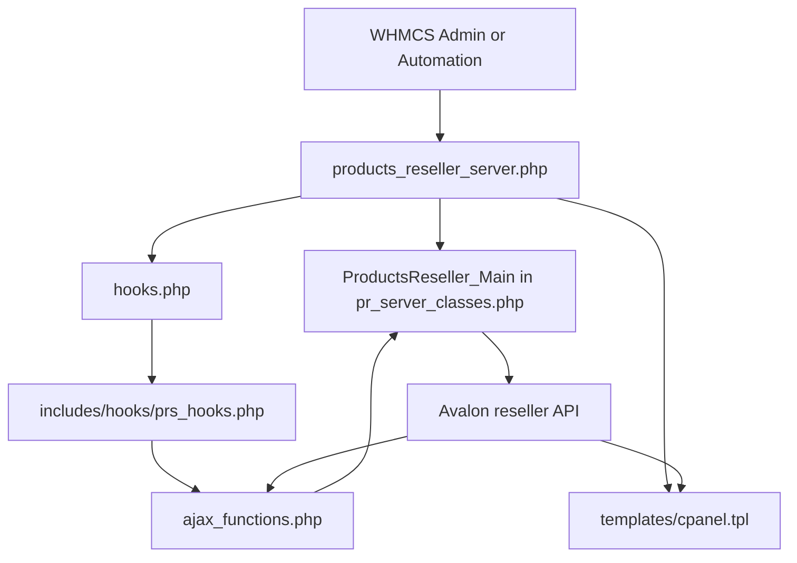
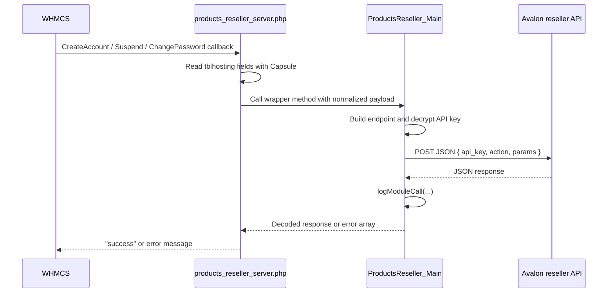

The module is organized around one required WHMCS entry file, one transport/helper class, one hook bootstrap file, one copied hook file for admin product import, one AJAX endpoint, and one client-area template. The codebase is small, but it relies heavily on WHMCS conventions, so understanding the call graph matters more than understanding inheritance or framework abstractions.

## Module Boundaries

### `products_reseller_server.php`

This is the main server-module entry point. WHMCS discovers it by filename and looks for callback names prefixed with `products_reseller_server_`. The file registers metadata, configuration options, provisioning callbacks, password and package actions, custom actions, and the client-area renderer. It also includes `hooks.php` and immediately calls `whmp_prs_copyFileToHooks()`, which is a deliberate bootstrap step to install the extra admin hook into `includes/hooks`.

### `pr_server_classes.php`

`ProductsReseller_Main` is the transport layer. Its `send_request_to_api()` method builds the provider endpoint from the WHMCS server row in `tblservers`, decrypts the stored API key through `localAPI('DecryptPassword', ...)`, emits a JSON POST request over cURL, logs the request with `logModuleCall()`, and returns the decoded API response. All provisioning methods delegate to it rather than reimplement transport logic.

### `hooks.php`

This file handles two jobs. First, it injects admin JavaScript that relabels the WHMCS server credentials form so the operator sees **API Endpoint** and **API Key** instead of the generic username/password labels. Second, it conditionally hides the admin cPanel login button on service pages when the upstream provider does not identify the service as cPanel.

### `hooks/prs_hooks.php`

This file is not active until it is copied into `includes/hooks`. Once loaded by WHMCS, it injects the product import/sync modal into the admin product configuration screen and registers a `ProductDelete` hook that removes product mappings from the upstream provider when a local WHMCS product is deleted.

### `ajax_functions.php`

This is the admin-side RPC endpoint used by the import modal. It has two actions:

- `getProductsForImport`, which loads importable provider products.
- `importSyncProducts`, which calculates margin-adjusted pricing, creates or updates local WHMCS products, and persists mappings back to the provider API.

### `templates/cpanel.tpl`

This template is only used when `GetServerName` returns `cpanel` for an active service. It renders package/domain details, disk and bandwidth usage, shortcut icons for cPanel applications, and a billing overview. For non-cPanel services, the module instead returns a JavaScript snippet that rewrites the client-area tab content with a simpler server information panel.

## Request and Data Lifecycle

The dominant lifecycle starts in WHMCS automation or admin actions:

The admin import lifecycle is separate:

1. `prs_hooks.php` adds a button and modal to the admin product screen.
2. The modal calls `ajax_functions.php?action=getProductsForImport`.
3. The endpoint asks the provider for products via `Get_Products_For_Import`.
4. The admin chooses margin rules, then submits selected products.
5. `ajax_functions.php?action=importSyncProducts` converts provider pricing into `tblpricing` rows keyed by local currency IDs, creates or syncs local products through `localAPI('AddProduct', ...)`, and saves the mapping through the provider action `Save_Product_Mapping`.

## Key Design Decisions

### One transport class for all upstream actions

All upstream API requests flow through `ProductsReseller_Main::send_request_to_api()` in `pr_server_classes.php`. That is why all public provisioning methods are extremely thin. The decision keeps request logging, endpoint construction, credential decryption, and JSON parsing in one place, which is pragmatic for a WHMCS module where code reuse matters more than elaborate abstractions.

### WHMCS database reads happen in the callback layer

The server-module callbacks in `products_reseller_server.php` read `tblhosting`, `tblproducts`, and `tblservers` through `Capsule` before calling the transport class. That keeps `ProductsReseller_Main` unaware of WHMCS service semantics and lets it operate on a plain request array. The trade-off is repeated query logic across callbacks, but the surface stays easy to trace because each callback assembles the upstream payload inline.

### Admin import uses a copied hook file

The module copies `hooks/prs_hooks.php` into `includes/hooks/prs_hooks.php` rather than relying only on the module directory. That matters because some WHMCS admin screens and hooks are loaded from the global hooks path, not from a server-module directory. The design is slightly invasive because it writes outside the module tree, but it guarantees the import UI is available without asking the reseller to manually install a second hook file.

### cPanel behavior is capability-driven, not product-driven

The module does not assume every service is cPanel. Instead it calls `GetServerName` and only enables SSO or the cPanel dashboard when the upstream API returns `cpanel`. That decision lets the same module support cPanel and non-cPanel products, but it also means UI behavior depends on a successful upstream capability check at runtime.

## How the Pieces Fit Together

The mental model is:

- `products_reseller_server.php` is the public contract WHMCS sees.
- `ProductsReseller_Main` is the provider API adapter.
- `hooks.php` tunes the WHMCS admin experience and manages bootstrap.
- `prs_hooks.php` and `ajax_functions.php` implement catalog import and mapping.
- `cpanel.tpl` renders the richer client experience for supported upstream services.

If you need the exact callbacks and runtime signatures, start at [Server Module](/docs/api-reference/server-module). If you need the internal request builder, go next to [ProductsReseller_Main](/docs/api-reference/main-class).
