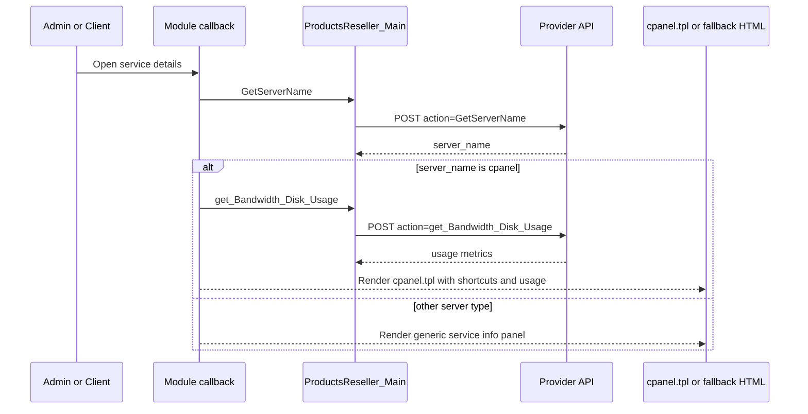

The module treats cPanel as a capability, not as a global assumption. That is the key idea behind its client-area rendering and SSO logic.

## What It Is

This concept covers three connected behaviors:

- whether WHMCS should show a cPanel login action
- whether the client area should render `templates/cpanel.tpl`
- whether non-cPanel services should fall back to a simpler server-information panel

All three decisions originate from one upstream API action: `GetServerName`.

## Why It Exists

The same reseller catalog can contain cPanel and non-cPanel products. If the module always exposed cPanel buttons and templates, users would see dead-end actions for services that cannot honor them. If it never exposed cPanel UI, users would lose valuable shortcuts and usage dashboards for accounts that do support cPanel. The module solves that by asking the provider at runtime.

## How It Relates To Other Concepts

- It depends on [Module Lifecycle](/docs/module-lifecycle) because the logic lives inside `products_reseller_server_CustomActions()`, `products_reseller_server_ServiceSingleSignOn()`, and `products_reseller_server_ClientArea()`.
- It depends on [API Transport](/docs/api-transport) because capability checks, usage fetches, and SSO URL generation all go through `ProductsReseller_Main`.
- It benefits from [Product Import and Sync](/docs/product-import-sync) because a mapped provider product is what eventually creates a service whose runtime server name may be `cpanel`.

## How It Works Internally

There are two UI contexts and both use the same provider capability check.

### Admin service page

`hooks.php` listens to `AdminAreaHeadOutput` on the `clientsservices` screen. It resolves a service ID from `$_GET` or from the generated page JavaScript, loads the service/server pair, and calls `GetServerName`. If the response is missing or not equal to `cpanel`, it injects JavaScript that hides the module single-sign-on button.

### Client area

`products_reseller_server_ClientArea($params)` first checks that the service exists and that its `domainstatus` is `Active`. It then calls `GetServerName`.

- If the provider says `cpanel`, the module calls `get_Bandwidth_Disk_Usage`, builds a `shortcuts` array of application targets like `Email_Accounts` and `FileManager_Home`, and returns `tabOverviewReplacementTemplate => 'cpanel.tpl'`.
- Otherwise it checks six config flags from `configoption2` through `configoption7` and builds a plain HTML panel showing server name, hostname, domain, IP, username, and optionally the decrypted service password.

### Single sign-on

When SSO is allowed, `products_reseller_server_ServiceSingleSignOn($params)` calls `CreateSSOSession` with `serviceid`, `server_id`, and an optional `app` value. If the provider returns a `url`, the callback returns `['success' => true, 'redirectTo' => $url]`. The same callback powers both the custom admin action and the quick shortcut links inside the cPanel template.



## Basic Usage Example

This is the direct SSO callback path for a cPanel service:

```php
<?php

$response = products_reseller_server_ServiceSingleSignOn([
    'serviceid' => 1205,
    'serverid' => 2,
]);

if ($response['success']) {
    echo $response['redirectTo'];
}
```

Expected output:

```text
https://provider.example.com:2083/cpsess...
```

## Advanced Example

The `app` parameter lets you deep-link into a specific cPanel area, which is how the quick shortcuts in `cpanel.tpl` work:

```php
<?php

$response = products_reseller_server_ServiceSingleSignOn([
    'serviceid' => 1205,
    'serverid' => 2,
    'app' => 'Database_phpMyAdmin',
]);

if (!$response['success']) {
    throw new RuntimeException($response['errorMsg']);
}

header('Location: ' . $response['redirectTo']);
exit;
```

You can swap the `app` value for entries such as `Email_Accounts`, `Backups_Home`, or `Cron_Home`, which match the shortcut definitions in `products_reseller_server.php`.

<Callout type="warn">
The non-cPanel client-area fallback can expose the decrypted service password when `show_password` is enabled. That is controlled by `configoption7` and implemented through `localAPI('DecryptPassword', ...)`, so treat that toggle as a deliberate security decision rather than a cosmetic display option.
</Callout>

<Accordions>
<Accordion title="Why capability checks happen at runtime instead of configuration time">
The module asks the provider whether a service is cPanel each time it needs to decide on SSO or UI rendering. That avoids stale assumptions if product behavior changes upstream or if multiple service types share the same server-module code. The cost is an extra API dependency on page load and action rendering, which means temporary provider issues can hide buttons or degrade the client area. For this module, correctness of the exposed UI is more important than eliminating one small runtime request.
</Accordion>
<Accordion title="Why the module has two client-area rendering modes">
Returning `cpanel.tpl` for cPanel services gives users a richer experience with usage statistics and direct shortcuts, which is valuable for common hosting workflows. Keeping a plain HTML fallback for non-cPanel services avoids forcing every product through a cPanel-centric template that may not fit. The trade-off is duplicated presentation logic: one mode is a Smarty template and the other is a JavaScript-built HTML panel. That split is justified because the data needs are materially different between cPanel and non-cPanel services.
</Accordion>
</Accordions>

For all callback signatures involved in this behavior, see [Server Module](/docs/api-reference/server-module) and [Admin Hooks](/docs/api-reference/admin-hooks).
