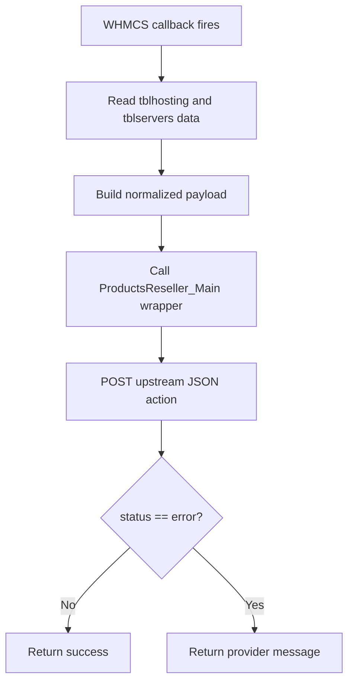

The core abstraction in this project is not a class. It is the WHMCS server-module callback contract implemented in `modules/servers/products_reseller_server/products_reseller_server.php`. WHMCS does not instantiate an object here. Instead it discovers globally named functions such as `products_reseller_server_CreateAccount()` and `products_reseller_server_SuspendAccount()` and invokes them at specific points in the service lifecycle.

## What It Is

The callback layer is the compatibility boundary between WHMCS and the reseller provider. It exists because WHMCS expects a fixed set of entry points, while the upstream reseller platform expects generic JSON actions such as `CreateAccount`, `SuspendAccount`, `Get_Products`, and `CreateSSOSession`. The module lifecycle code translates from the former to the latter.

## How It Relates To Other Concepts

- It depends on [API Transport](/docs/api-transport) for the actual HTTP call.
- It feeds [Client Area and SSO](/docs/client-area-and-sso) because the same file decides whether to render `cpanel.tpl` or a generic service information tab.
- It works with [Product Import and Sync](/docs/product-import-sync) indirectly by exposing `ConfigOptions`, which pulls the provider product list for the WHMCS module settings screen.

## How It Works Internally

`products_reseller_server.php` starts by requiring `pr_server_classes.php`, including `hooks.php`, and calling `whmp_prs_copyFileToHooks()`. After that bootstrap, the lifecycle functions break down into four groups:

### Discovery and configuration

- `products_reseller_server_MetaData()` returns the display name, API version, server requirement, and SSO labels.
- `products_reseller_server_TestConnection($params)` looks up the active server ID from `tblservers`, calls `Get_Products`, and treats a non-empty `data` array as success.
- `products_reseller_server_ConfigOptions($params)` calls the same `Get_Products` action, then turns the returned provider products into the `configoption1` dropdown plus six yes/no flags controlling non-cPanel client-area fields.

### Provisioning callbacks

`CreateAccount`, `SuspendAccount`, `UnsuspendAccount`, `TerminateAccount`, `ChangePackage`, and `ChangePassword` all follow the same pattern:

1. Read service fields from `tblhosting` through `Capsule`.
2. Normalize them into a provider payload.
3. Add an action string such as `CreateAccount`.
4. Delegate to the matching wrapper method on `ProductsReseller_Main`.

The important detail is that the wrapper methods return either the literal string `success` or the provider error message. WHMCS server modules use that convention, so the transport layer cannot simply return the raw JSON response here.



### Conditional custom actions

`products_reseller_server_CustomActions($params)` is a gatekeeper for the admin cPanel login button. It only returns a `CustomActionCollection` containing `Log in to cPanel` if the server type matches `products_reseller_server` and the provider responds to `GetServerName` with `cpanel`. Otherwise the collection stays empty.

### Client-area rendering

`products_reseller_server_ClientArea($params)` first loads the service and product records, then checks `GetServerName`. If the service status is `Active` and the server name is `cpanel`, it fetches usage metrics using `get_Bandwidth_Disk_Usage` and returns `tabOverviewReplacementTemplate => 'cpanel.tpl'` with structured variables. Otherwise it builds an HTML snippet based on config options 2 through 7 and injects a single "Service Information" tab with JavaScript.

## Basic Usage Example

This is the minimum provisioning callback path if you are tracing execution during a real WHMCS order:

```php
<?php

$result = products_reseller_server_CreateAccount([
    'serviceid' => 1205,
    'serverid' => 2,
    'password' => 'TempPassword123!',
    'configoption1' => 44,
]);

if ($result !== 'success') {
    throw new RuntimeException($result);
}
```

In practice WHMCS supplies the `$params` array. This example is useful when you are reading the code, building integration tests around a WHMCS fixture, or debugging provisioning failures.

## Advanced Example

The SSO path has more branches because it accepts an optional `app` argument and must produce a redirect URL:

```php
<?php

$sso = products_reseller_server_ServiceSingleSignOn([
    'serviceid' => 1205,
    'serverid' => 2,
    'app' => 'FileManager_Home',
]);

if ($sso['success']) {
    header('Location: ' . $sso['redirectTo']);
    exit;
}

echo $sso['errorMsg'];
```

The same callback is used for both the WHMCS custom action and the shortcut links rendered in `cpanel.tpl`.

<Callout type="warn">
`products_reseller_server_TestConnection()` and `products_reseller_server_ConfigOptions()` do not use the specific server passed in `$params`; both query the first active `products_reseller_server` row from `tblservers`. In multi-server or staged environments, that means connection tests and product dropdowns can target the wrong upstream server unless only one active module server exists.
</Callout>

<Accordions>
<Accordion title="Why thin callbacks are the right trade-off here">
The callbacks do very little beyond reading WHMCS records and forwarding normalized data. That is a good trade-off for a WHMCS module because the framework contract is function-based, not object-oriented, and future maintainers usually debug these files first. The downside is some repetition across `CreateAccount`, `SuspendAccount`, and related functions, but the repetition is easy to search and reason about. If the code hid that logic behind more indirection, tracing which fields are sent upstream during provisioning would become harder, not easier.
</Accordion>
<Accordion title="Why the module returns strings instead of rich result objects">
The wrapper methods collapse provider success into the literal string `success` because that is the value WHMCS expects from server-module lifecycle callbacks. A richer return object would make internal testing cleaner, but WHMCS would still need a final translation step. By performing the translation immediately, the code keeps the public boundary aligned with WHMCS conventions. The cost is that some structured provider data is intentionally discarded during create, suspend, terminate, and password-change flows.
</Accordion>
</Accordions>

For the exact signatures and source locations of every lifecycle callback, continue to [Server Module](/docs/api-reference/server-module).
