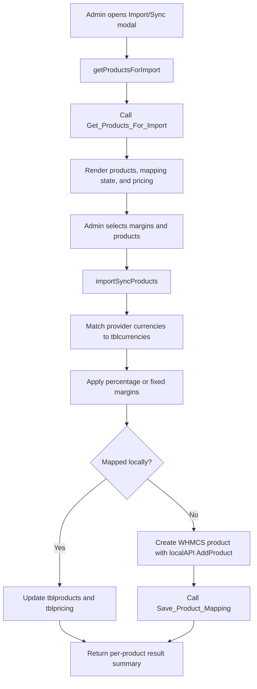

The product import pipeline is the most opinionated part of the module. It spans `hooks/prs_hooks.php` and `ajax_functions.php`, and it solves a real reseller problem: keeping the provider catalog, local WHMCS products, and local pricing aligned without manual product creation for every upstream plan.

## What It Is

This concept is an admin-only catalog synchronization flow. It injects an **Import/Sync Products** button into the WHMCS product configuration screen, fetches the provider catalog through AJAX, lets the operator apply global or per-product margins, and then either creates new WHMCS products or updates existing mapped ones.

## Why It Exists

Manual catalog management creates three common failures:

- provider products exist but are not available in WHMCS
- mapped products drift on pricing or descriptions
- local prices are overwritten inconsistently when resellers apply markup by hand

The import/sync flow exists to make those operations explicit and repeatable.

## How It Relates To Other Concepts

- It depends on [API Transport](/docs/api-transport) because both product fetch and mapping persistence call the same upstream API adapter.
- It extends [Module Lifecycle](/docs/module-lifecycle) because imported WHMCS products are created with `module = products_reseller_server` and `configoption1 = provider product ID`, which is what later provisioning callbacks use.
- It affects [Client Area and SSO](/docs/client-area-and-sso) indirectly because product mappings determine which upstream service type and server behavior a WHMCS order represents.

## How It Works Internally

The UI lives in `hooks/prs_hooks.php`. That hook:

1. Checks that the module exists and an active `products_reseller_server` server record is present.
2. Injects CSS and JavaScript into the `configproducts` admin page.
3. Builds a modal with a global margin selector, a selectable products table, and progress/results sections.
4. Calls `../modules/servers/products_reseller_server/ajax_functions.php` for both loading and processing.

The server-side processing lives in `ajax_functions.php`.



### Currency matching

The code does not assume provider currency IDs match WHMCS currency IDs. Instead it matches by `currency_code` against `tblcurrencies.code`. If no local currency matches the provider price data, the product fails with `No matching currencies found between provider and local system.`

### Margin rules

Two margin modes are supported:

- `percentage`: multiplies recurring prices and setup fees by `1 + margin/100`
- `fixed`: adds a fixed amount to recurring prices only

Disabled cycles remain `-1.00`, which preserves WHMCS semantics for unavailable billing terms.

### Import vs sync

If a provider product is already mapped and the local product still exists, the code updates `tblpricing` rows for each matched currency and refreshes the WHMCS product name and description. If the mapping points at a deleted local product, the code downgrades that row back into an import operation. New products are created through `localAPI('AddProduct', ...)`, optionally assigned to the same server group as the active module server, and then linked upstream through `Save_Product_Mapping`.

### Mapping cleanup

`prs_hooks.php` also registers a `ProductDelete` hook. When a WHMCS product is removed, it calls the upstream `Delete_Product_Mapping` action so the provider catalog does not keep a stale local product reference.

## Basic Usage Example

A realistic basic flow is operational rather than programmatic:

```text
1. Open WHMCS Admin > System Settings > Products/Services.
2. Click Import/Sync Products.
3. Keep the global margin at 0%.
4. Select one unmapped provider product.
5. Click Import / Sync Selected.
```

Expected result:

```text
1 product(s) processed successfully
```

That path creates a local WHMCS product, stores its pricing in `tblpricing`, sets `module = products_reseller_server`, and saves the mapping back to the provider API.

## Advanced Example

This mirrors the payload sent by the modal for a mixed import/sync batch with custom margins:

```json
[
  {
    "product_id": 45,
    "product_name": "Starter Hosting",
    "product_type": "hostingaccount",
    "product_group_name": "Shared Hosting",
    "paytype": "recurring",
    "is_mapped": false,
    "reseller_product_id": 0,
    "margin_type": "percentage",
    "margin_value": 20,
    "pricing": [
      {
        "currency_code": "USD",
        "pricing": {
          "monthly": 5.00,
          "quarterly": -1,
          "semiannually": -1,
          "annually": 50.00,
          "biennially": -1,
          "triennially": -1,
          "msetupfee": 0,
          "qsetupfee": 0,
          "ssetupfee": 0,
          "asetupfee": 0,
          "bsetupfee": 0,
          "tsetupfee": 0
        }
      }
    ]
  }
]
```

With a 20% percentage margin, `monthly` becomes `6.00` and `annually` becomes `60.00` before the local product is created or synced.

<Callout type="warn">
If the provider exposes currencies that do not exist locally in `tblcurrencies`, the module silently skips those currency blocks and may fail the product entirely if none match. Before bulk import, align WHMCS currency codes with the provider catalog or you will get partial imports that look like pricing bugs.
</Callout>

<Accordions>
<Accordion title="Why the module syncs pricing directly into tblpricing">
Direct `tblpricing` writes make sync idempotent and predictable because the code can update only the currencies and cycles it understands without going through multiple layers of WHMCS UI logic. That keeps the sync fast and allows precise control over disabled billing terms represented as `-1.00`. The cost is that this code is tightly coupled to WHMCS pricing schema details, so schema changes in future WHMCS versions would need code review. For this module, that trade-off is acceptable because pricing fidelity is more important than abstraction.
</Accordion>
<Accordion title="Why fixed and percentage margins are both supported">
Percentage margins preserve relative price differences across plans and are usually the safer default for hosting catalogs with different base prices. Fixed margins are simpler when the reseller wants a uniform markup like `$2.00` per recurring cycle, but that can distort low-cost entry plans more aggressively. The code reflects that trade-off by applying fixed margins only to recurring prices, not setup fees, while percentage margins affect both recurring prices and setup fees. That behavior is visible both in `ajax_functions.php` and in the live preview renderer inside `prs_hooks.php`.
</Accordion>
</Accordions>

To see the exact AJAX request shapes and result payloads, continue to [AJAX Endpoint](/docs/api-reference/ajax-endpoint).
